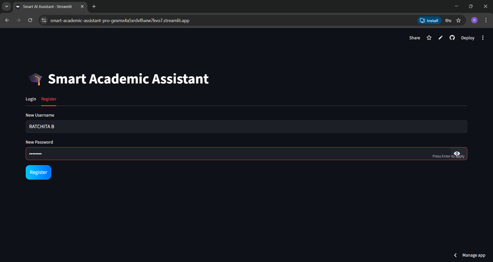
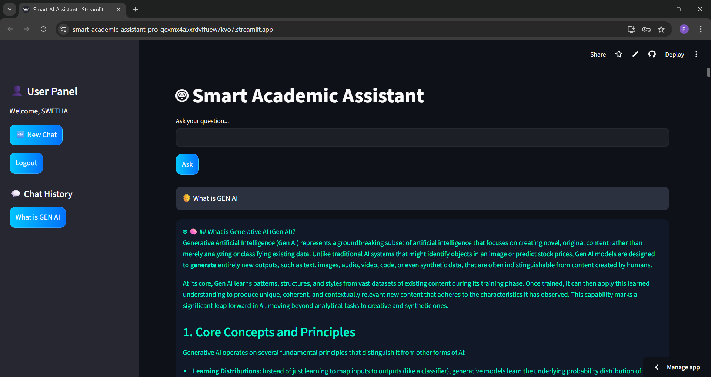

---


---

# 🎓 Smart Academic Assistant Pro

> 🧠 AI-Powered Academic Assistant for Smart Learning using Generative AI

---

## 🚀 Live Demo

🌐 **Frontend (Streamlit App):**
👉 https://smart-academic-assistant-pro-gexmx4a5xrdvffuew7kvo7.streamlit.app/

⚙️ **Backend (FastAPI - Render):**
👉 https://smart-academic-assistant-pro.onrender.com/

---

## 🧠 Overview

**Smart Academic Assistant Pro** is a full-stack AI application that helps students:

* 🤖 Ask academic questions
* 📚 Get structured AI-generated answers
* 🧠 Understand concepts easily
* 💬 Maintain chat history per user

It uses **Google Gemini AI** to generate intelligent, well-structured responses.

---

## ✨ Features

### 🔐 Authentication System

* Login / Register
* Session-based user handling
* JSON-based local storage

### 🤖 AI Assistant

* Powered by **Google Gemini (gemini-2.5-flash)**
* Generates:

  * Structured answers
  * Headings
  * Bullet points
  * Examples
  * Key Points
  * Mindmaps (text format)

### 💬 Chat System

* Chat history per user
* Sidebar navigation
* “New Chat” functionality

### ⚡ Performance

* Fast API responses
* Lightweight architecture
* Optimized for cloud deployment

---

## 🧠 Tech Stack

| Technology        | Purpose                    |
| ----------------- | -------------------------- |
| Streamlit         | Frontend UI                |
| FastAPI           | Backend API                |
| Google Gemini API | AI (LLM)                   |
| Python            | Core logic                 |
| JSON              | Data storage (users/chats) |

---

## 📁 Project Structure

```
smart-academic-assistant-pro/
│
├── app/
│   ├── api/
│   │   └── routes.py
│   │
│   ├── auth/
│   │   └── auth.py
│   │
│   ├── services/
│   │   └── llm_service.py
│   │
│   └── config.py
│
├── data/
│   ├── users.json
│   └── chats.json
│
├── frontend/
│   └── app.py
│
├── main.py
├── requirements.txt
├── .gitignore
├── README.md
└── LICENSE
```

---

## 📸 Screenshots

### 🔐 Login Page


### 🤖 Chat Interface


---

## ⚙️ Installation

### 1️⃣ Clone Repository

```bash
git clone https://github.com/22AD040/smart-academic-assistant-pro.git
cd smart-academic-assistant-pro
```

---

### 2️⃣ Create Virtual Environment

```bash
python -m venv venv
venv\Scripts\activate
```

---

### 3️⃣ Install Dependencies

```bash
pip install -r requirements.txt
```

---

### 4️⃣ Set Environment Variables

Create `.env` file:

```env
GEMINI_API_KEY=your_api_key_here
```

---

## ▶️ Run Locally

### Backend (FastAPI)

```bash
uvicorn main:app --reload
```

---

### Frontend (Streamlit)

```bash
streamlit run frontend/app.py
```

---

## 🌐 Deployment

### 🔹 Backend (Render)

* Create Web Service
* Add environment variable:

```
GEMINI_API_KEY=your_key
```

* Start command:

```bash
uvicorn main:app --host 0.0.0.0 --port $PORT
```

---

### 🔹 Frontend (Streamlit Cloud)

Add secrets:

```toml
GEMINI_API_KEY = "your_key"
```

---

## 🔒 Security

* 🔐 API keys stored securely (`.env` / Streamlit secrets)
* 🚫 No sensitive data in GitHub
* 👤 User data isolated per session
* 📁 `.gitignore` prevents data leakage

---

## ⚠️ Known Limitations

* ⏳ First response may be slow (Render free tier)
* 🔁 Backend sleeps after inactivity
* 🌐 Requires internet for API calls

---

## 🚀 Future Improvements

* 🔐 Password hashing (bcrypt)
* 📊 Advanced UI improvements
* 🌍 Multi-language support
* 📱 Mobile responsiveness
* 🧠 Context memory improvements

---

## 👩‍💻 Author

**Ratchita B**
🎓 Artificial Intelligence & Data Science

---

## ⭐ Support

If you like this project:

👉 Give it a ⭐ on GitHub
👉 Share with others

---

## 📜 License

This project is licensed under the **MIT License**
